## Markdown 中 Mermaid 图表完整指南

本文演示如何在 Markdown 文档中使用 Mermaid 创建各种复杂图表，包括流程图、时序图、ER 图、类图、状态图、XY 图、甘特图、思维导图等。

> Mermaid 图表由 [Merman](https://github.com/Latias94/merman) 实现。Firefly 在 Astro 构建阶段生成亮色和深色两套静态 SVG，无需在浏览器中加载 Mermaid 渲染运行时。可以前往 [Merman Playground](http://frankorz.com/merman/) 实时编辑语法并预览渲染结果。

## 流程图示例

流程图非常适合表示流程或算法步骤。


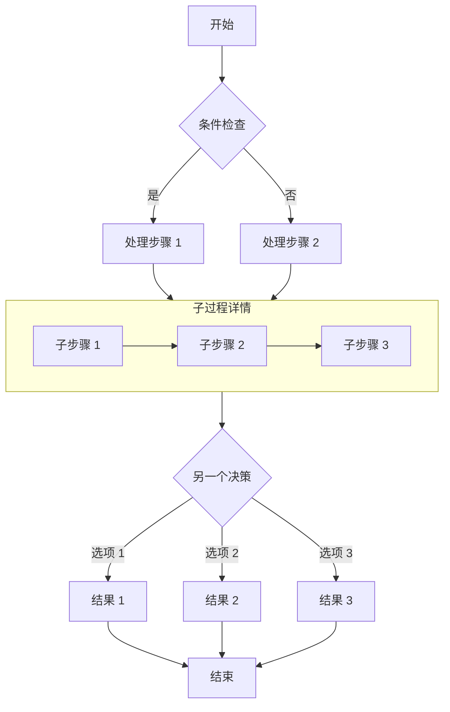

## 时序图示例

时序图显示对象之间随时间的交互。

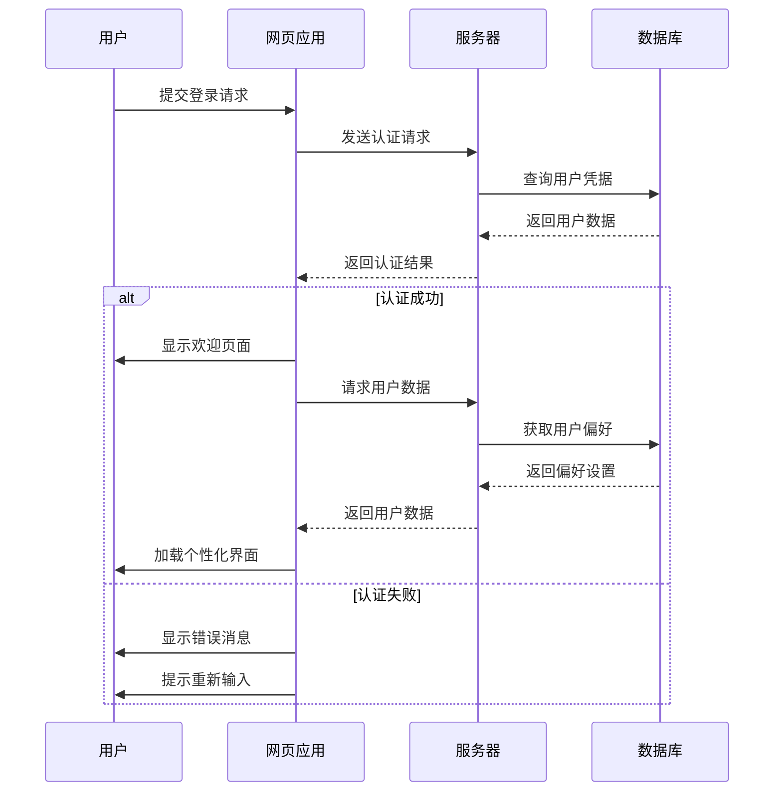

## ER 图示例

ER 图（实体关系图）非常适合表示数据库结构。

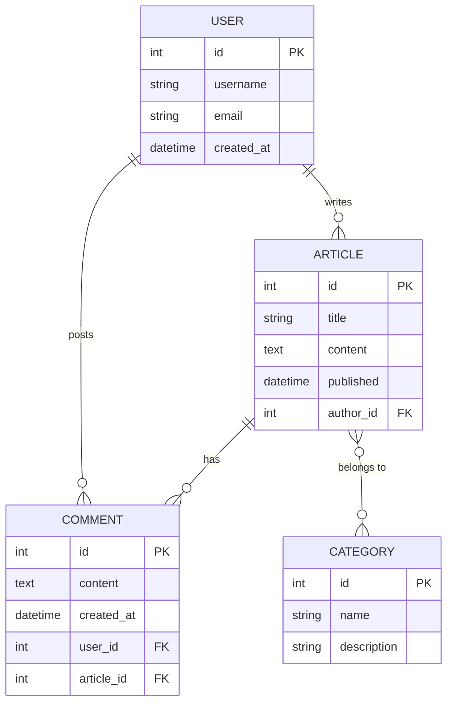

## 类图示例

类图显示系统的静态结构，包括类、属性、方法及其关系。

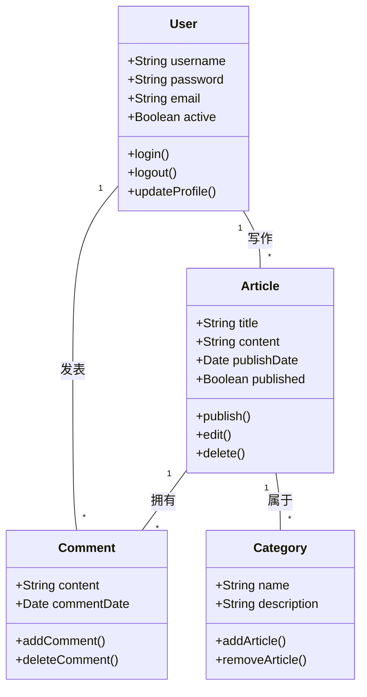

## 状态图示例

状态图显示对象在其生命周期中经历的状态序列。

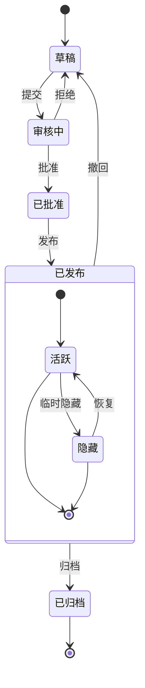

## XY 图示例

XY 图表非常适合展示趋势和对比数据。

```mermaid
xychart-beta
    title "月度访问量趋势"
    x-axis [1月, 2月, 3月, 4月, 5月, 6月]
    y-axis "访问量" 0 --> 5000
    bar [2500, 3200, 4100, 3800, 4500, 4800]
    line [2500, 3200, 4100, 3800, 4500, 4800]
```

## 饼图示例

饼图适合直观展示各部分在整体中的占比。

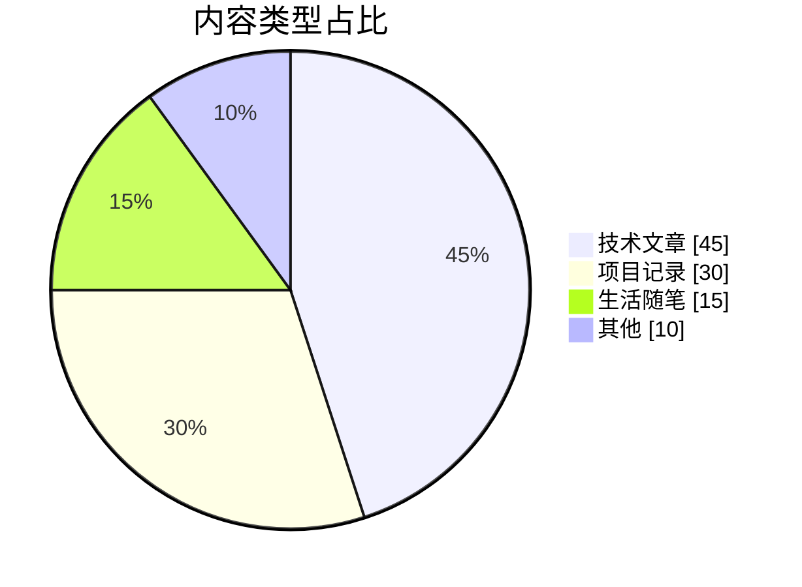

## 甘特图示例

甘特图可以按时间轴展示项目阶段、任务依赖和当前进度。

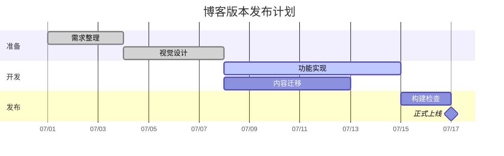

## 思维导图示例

思维导图适合梳理主题层级和知识结构。

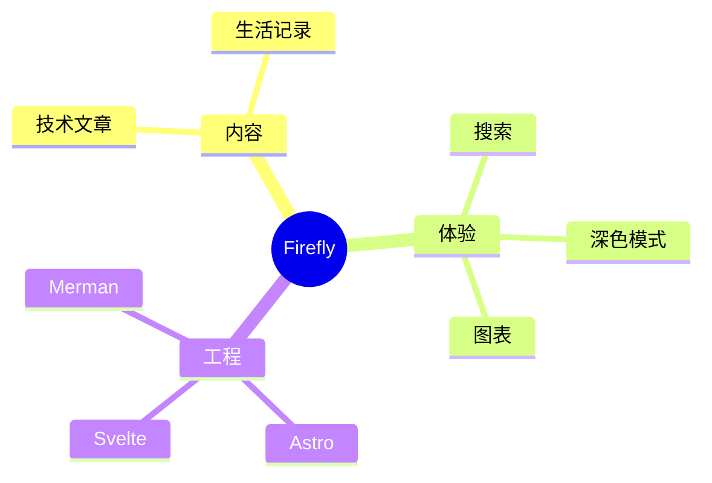

## 时间线示例

时间线用于按年份或阶段呈现项目的重要事件。

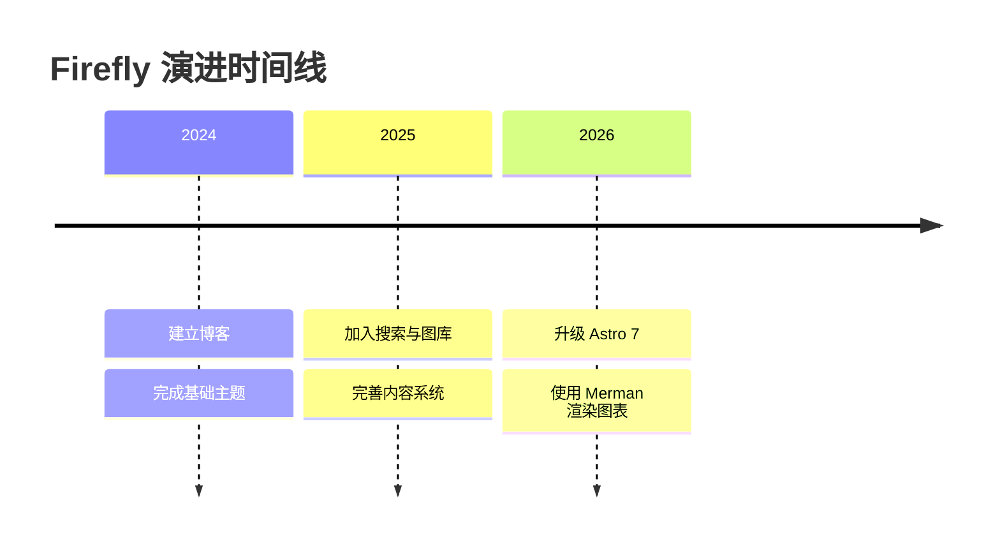

## 用户旅程图示例

用户旅程图能够描述用户在不同阶段的行为和体验评分。

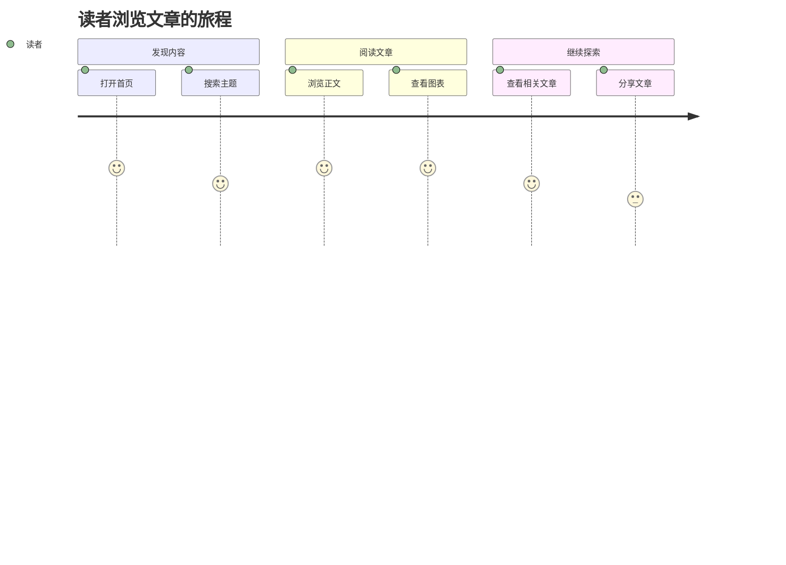

## Git 图示例

Git 图可以清晰展示分支、提交和合并历史。

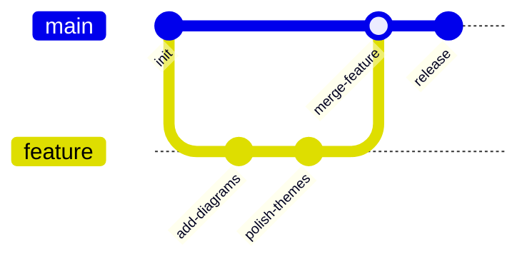

## 看板示例

看板适合展示任务在不同工作阶段之间的分布。

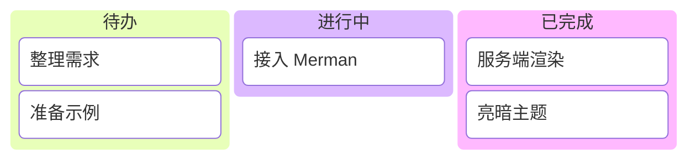

## Sankey 图示例

Sankey 图通过连线宽度展示流量在不同节点之间的流向。

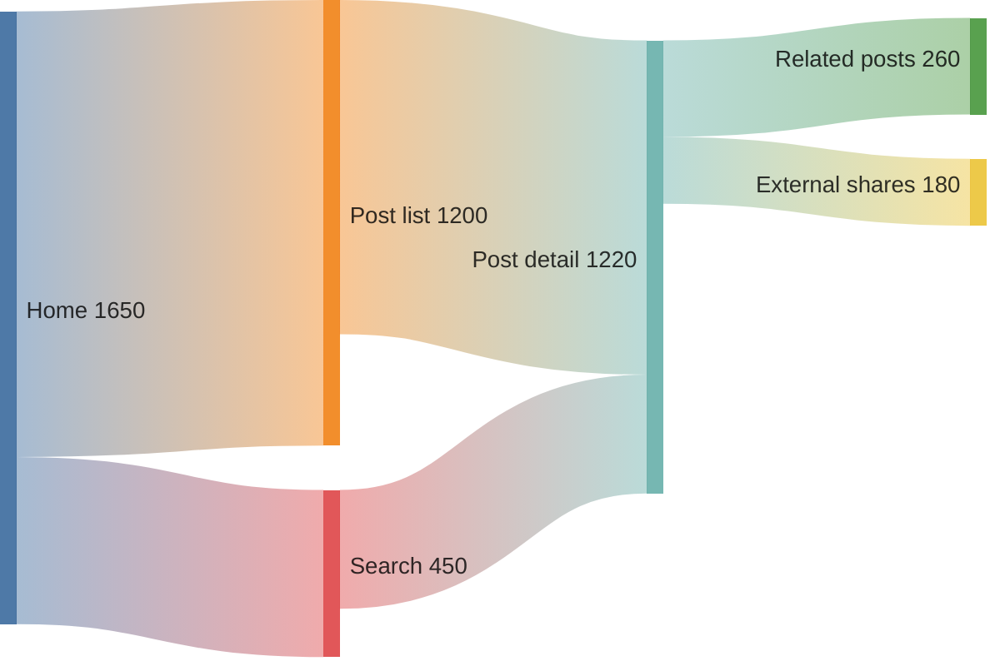

## 总结

Mermaid 是在 Markdown 文档中创建各种类型图表的强大工具。本文演示了流程图、时序图、ER 图、类图、状态图、XY 图、饼图、甘特图、思维导图、时间线、用户旅程图、Git 图、看板和 Sankey 图。这些图表可以帮助您更清晰地表达复杂的概念、流程和数据结构。

要使用 Mermaid，只需在代码块中指定 mermaid 语言，并使用简洁的文本语法描述图表。图表会在构建时自动渲染为 SVG，无需客户端 JavaScript 加载。

可以前往 [Merman Playground](http://frankorz.com/merman/) 尝试更多语法，再将图表代码粘贴到文章中。
